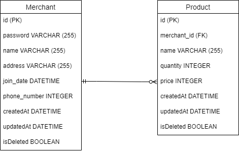

# merchant-service

This is the second mini project from Dibimbing bootcamp. This project uses [ExpressJs](https://www.npmjs.com/package/express) framework and MySQL as the database.

# Installation

Run these on your terminal in root project directory:
- `npm install express`
- `npm install mysql`
- `npm install bcrypt`
- `npm install jsonwebtoken`
- `npm install validatorjs`

# Database Configuration

This is how to setup the database configuration.

- Open **./config/db.js** and you will see the followng code:

```javascript
var mysql = require('mysql');
var db = mysql.createConnection({
  host: "Your MySQL host", // "localhost" by default
  user: "Your MySQL user", // "root" by default
  password: "Your MySQL password",
  database: "miniProject",
  port: "Your database's port",
});

module.exports = db;
```

- Change the value of **host**, **user**, **password**, and **port** to your MySQL configuration.
- To create tables in your local database, you should run `node .\mysql\create.js`

# Run The App

- In the root directory you should run `node .\app\` on your terminal.
- The server uses port: `3000` and it will be running on [http://localhost:3000](http://localhost:3000). You can change your port in **./app.js**

# API Usage

This project use 2 groups, merchant and product.



A merchant needs number and password for login. A Merchant has name, address, and join date. A product has name, quantity, and price.
A merchant can has several product and can have no product. Every product has only one merchant.


## 1. Merchant

<summary><b>Create Merchant</b></summary>

<p>

`POST` `/signup`

_Parameters:_ body

- `password` string, min:6 \*required
- `name` string, min:3, max:50 \*required
- `address` string \*required
- `phone_number` integer \*required

_Response:_ JSON

- `status: 200` registration success

```json
{
  "message": "Merchant has been registered."
}
```

- `status: 400` parameters validation failed

```json
{
    "message": "Error on: ",
    "data": {
        "param_key": [
            "error message array."
        ]
    }
}
```

</p>

---

<summary><b>Merchant Login</b></summary>

<p>

`POST` `/login`

_Parameters:_ body

- `phone_number` string \*required
- `password` string, min:6 \*required

_Response:_ JSON

- `status: 200` login success

```json
{
  "message": "Login success.",
  "token": "token"
}
```

- `status: 400` login failed

```json
{
  "message": "Phone number or password is invalid."
}
```

</p>

---

<summary><b>Delete merchant</b></summary>

<p>

`DELETE` `/delacc/:id`

Deleting merchant is using soft delete method. The Data actually still exist in database. If you want to delete the data, you should delete directly from your database application.

_Authorization:_ Bearer Token

- `token` token from login response \*required

_Parameters:_

- path

  `id` (merchant id) integer \*required

- body

  `password` \*required

_Response:_ JSON

- `status: 200` delete success

```json
{
  "message": "Merchant has been deleted."
}
```

- `status: 400` parameters validation failed

```json
{
  "message": "Merchant not found. You should try to re-login."
}
```

- `status: 401` unauthorized

```json
{
  "message": "Unauthorized"
}
```

- `status: 400` wrong authorization format

```json
{
  "auth": false,
  "message": "Wrong authorization format"
}
```

- `status: 401` token expired

```json
{
  "auth": false,
  "message": "Token expired"
}
```

- `status: 401` authorization failed

```json
{
  "auth": false,
  "message": "Invalid Token"
}
```

</p>


## 2. Product

<summary><b>Get list of product</b></summary>

<p>

`GET` `/listproduct/:id`

_Authorization:_ Bearer Token

- `token` token from login response \*required

_Parameters:_ path

- `id` (merchant id) integer \*required

_Response:_ JSON

- `status: 200` get data success

```json
[
  {
    "id": "integer",
    "name": "string",
    "quantity": "integer",
    "price": "integer",
    "createdAt": "datetime",
    "updatedAt": "datetime",
    "isDeleted": "boolean"
  }
]
```

- `status: 401` unauthorized

```json
{
  "message": "Unauthorized"
}
```

- `status: 400` wrong authorization format

```json
{
  "auth": false,
  "message": "Wrong authorization format"
}
```

- `status: 401` token expired

```json
{
  "auth": false,
  "message": "Token expired"
}
```

- `status: 401` authorization failed

```json
{
  "auth": false,
  "message": "Invalid Token"
}
```

</p>

---

<summary><b>Add product</b></summary>

<p>

`POST` `/entryproduct/:id`

_Authorization:_ Bearer Token

- `token` token from login response \*required

_Parameters:_ 
- path

  - `id` (merchant id) integer \*required

- body

  - `name` string, min:3, max:50 \*required
  - `quantity` integer, min:1 \*required
  - `price` integer, min:10000 \*required

_Response:_ JSON

- `status: 200` add product success

```json
{
  "message": "Product has been inserted."
}
```

- `status: 400` parameters validation failed

```json
{
  "message": {
    "param_key": ["error message array"]
  }
}
```

- `status: 401` unauthorized

```json
{
  "message": "Unauthorized"
}
```

- `status: 400` wrong authorization format

```json
{
  "auth": false,
  "message": "Wrong authorization format"
}
```

- `status: 401` token expired

```json
{
  "auth": false,
  "message": "Token expired"
}
```

- `status: 401` authorization failed

```json
{
  "auth": false,
  "message": "Invalid Token"
}
```

</p>

---

<summary><b>Update product</b></summary>

<p>

`PUT` `/entryproduct/:id`

_Authorization:_ Bearer Token

- `token` token from login response \*required

_Parameters:_ 
- path

  - `id` (product id) integer \*required

- body

  - `name` string, min:3, max:50 \*required
  - `quantity` integer, min:1 \*required
  - `price` integer, min:10000 \*required

_Response:_ JSON

- `status: 200` update product success

```json
{
  "message": "Product has been updated."
}
```

- `status: 401` unauthorized

```json
{
  "message": "Unauthorized"
}
```

- `status: 400` wrong authorization format

```json
{
  "auth": false,
  "message": "Wrong authorization format"
}
```

- `status: 401` token expired

```json
{
  "auth": false,
  "message": "Token expired"
}
```

- `status: 401` authorization failed

```json
{
  "auth": false,
  "message": "Invalid Token"
}
```

</p>

---

<summary><b>Delete product</b></summary>

Deleting product is using soft delete method. The Data actually still exist in database. If you want to delete the data, you should delete directly from your database application.

<p>

`DELETE` `/entryproduct/:id`

_Authorization:_ Bearer Token

- `token` token from login response \*required

_Parameters:_ path

- `id` (product id) integer \*required

_Response:_ JSON

- `status: 200` delete product success

```json
{
  "message": "Product has been deleted."
}
```

- `status: 401` unauthorized

```json
{
  "message": "Unauthorized"
}
```

- `status: 400` wrong authorization format

```json
{
  "auth": false,
  "message": "Wrong authorization format"
}
```

- `status: 401` token expired

```json
{
  "auth": false,
  "message": "Token expired"
}
```

- `status: 401` authorization failed

```json
{
  "auth": false,
  "message": "Invalid Token"
}
```

</p>

For test the API, you can use [Postman](https://www.postman.com/).
You can import my postman collection (**merchant-service.postman_collection**) and try the API.